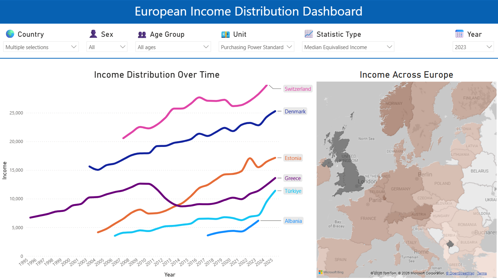

# Eurostat Income Analytics Pipeline

An end-to-end data engineering and business intelligence project built using publicly available Eurostat income distribution data.

The project demonstrates the complete analytics workflow, from data extraction and transformation to dimensional modeling, SQL analysis, and interactive dashboard development in Power BI.

---

## Dashboard Preview



*Interactive Power BI dashboard for exploring European income distribution by country, year, age group, sex, income type, and unit.*

---

## Project Overview

This project builds an analytical data warehouse using the Eurostat **ilc_di03** dataset and provides an interactive dashboard for exploring income distribution across European countries.

The project showcases practical skills in:

- Data extraction from Eurostat
- Data cleaning and transformation with Python and Pandas
- Star schema dimensional modeling
- PostgreSQL data warehousing
- SQL-based data validation and exploratory data analysis (EDA)
- Interactive Power BI dashboard development

---

## Dataset

**Source:** Eurostat

**Dataset:** `ilc_di03` – Income distribution by age and sex

The pipeline retrieves raw data directly from Eurostat, transforms it into a star-schema warehouse, and produces an interactive dashboard for income analysis.

---

# Dashboard

The Power BI dashboard enables users to explore income distribution across Europe through interactive visualizations.

### Features

- Multi-country income trend comparison
- Income evolution over time (1995–2025)
- Interactive European choropleth map
- Filtering by:
  - Country
  - Year
  - Age group
  - Sex
  - Income type (Mean / Median)
  - Unit

### Dashboard Visualizations

- **Line Chart**
  - Compare one or multiple countries over time
  - Displays income trajectories

- **Europe Filled Map**
  - Choropleth map showing income distribution by country
  - Color intensity represents income values
  - Updates dynamically for the selected year

---

# Project Workflow

```text
Eurostat
      │
      ▼
Extract
      │
      ▼
Transform & Clean (Python + Pandas)
      │
      ▼
Star Schema
      │
      ▼
PostgreSQL Data Warehouse
      │
      ▼
SQL Validation & EDA
      │
      ▼
Power BI Dashboard
```

---

# Data Warehouse Schema

```text
                 dim_country
                     │
                 country_id
                     │
dim_age ─────── fact_income ─────── dim_sex
                     │
                statinfo_id
                     │
                dim_statinfo
                     │
                  unit_id
                     │
                  dim_unit
```

---

# Repository Structure

```text
.
├── data/
│   ├── raw/
│   └── processed/
│
├── etl/
│   ├── dimensions.py
│   ├── extract.py
│   ├── load.py
│   ├── pipeline.py
│   ├── transform.py
│   └── utils.py
│
├── sql/
│   ├── create_views.sql
│   ├── validation.sql
│   └── eda.sql
│
├── dashboard/
│   └── Eurostat_Income_Distribution_Dashboard.pbix
│
└── README.md
```

---

# Technologies

- Python
- Pandas
- PostgreSQL
- SQLAlchemy
- SQL
- Power BI
- Git
- GitHub

---

# Project Highlights

✔ Automated data extraction from Eurostat

✔ Data transformation and cleaning

✔ Star schema dimensional modeling

✔ PostgreSQL analytical warehouse

✔ SQL validation and exploratory analysis

✔ Interactive Power BI dashboard

✔ End-to-end analytics workflow

---

## Author

George Aliquis