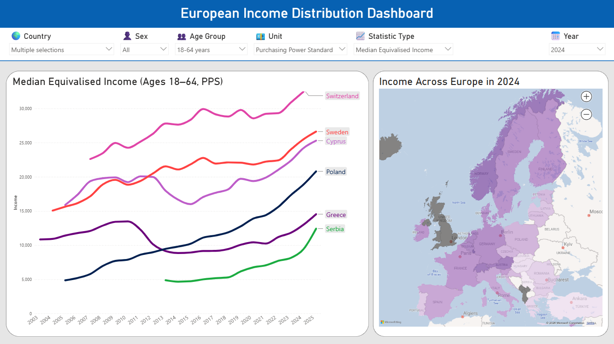

# European Income Distribution Analytics Pipeline

An end-to-end data analytics and business intelligence project using publicly available Eurostat income distribution data.  The project covers data extraction, preparation, dimensional modeling, SQL analysis, and interactive dashboard development in Power BI.

---

## Table of Contents

- [Project Overview](#project-overview)
- [Dashboard Preview](#dashboard-preview)
- [Analytical Questions](#analytical-questions)
- [Dataset](#dataset)
- [Dashboard](#dashboard)
- [Project Workflow](#project-workflow)
- [Data Warehouse Schema](#data-warehouse-schema)
- [Repository Structure](#repository-structure)
- [Technologies](#technologies)
- [Author](#author)

---

## Project Overview

This project analyzes income distribution data from Eurostat, covering mean and median income across European countries from 1995 to 2025. The data is extracted directly from Eurostat, cleaned and transformed with Python and Pandas, modeled using a star schema, and loaded into PostgreSQL for SQL-based validation and exploratory analysis.

The resulting data model is used in Power BI to enable interactive analysis of how income varies across countries and changes over time, with filtering by age group, sex, unit, and statistic type (mean / median).
 
The project combines data extraction, preparation, dimensional modeling, data warehousing, SQL analysis, and business intelligence into an end-to-end analytics workflow.

---

## Dashboard Preview



*Interactive dashboard developed in Power BI for exploring European income distribution by country, year, age group, sex, unit, and statistic type.*

---

## Analytical Questions

The project was designed to explore questions such as:

- How has income changed across European countries over time?
- How do mean and median income differ across countries?
- How do income levels vary by age group and sex?
- Which countries show the largest changes in income over time?
- How do income trends differ between demographic groups?

---
## Dataset

**Source:** [Eurostat](https://ec.europa.eu/eurostat/)

**Dataset:** `ilc_di03` – *Mean and median income by age and sex (source: SILC)*

**Data coverage:** *1995 - 2025*

The dataset is part of the **EU Statistics on Income and Living Conditions (EU-SILC)** and provides comparable statistics on income across European countries. It contains **mean and median equivalised disposable income**, broken down by **country, year, age group, and sex**, with income reported using different units of measure, including **euro and purchasing power standard (PPS)**.

EU-SILC is Eurostat's reference data source for monitoring income distribution, poverty, social exclusion, and living conditions across Europe. National indicators are also used to calculate European aggregates, where sufficient population coverage is available.

For this project, the `ilc_di03` dataset is extracted from Eurostat, transformed with Python and Pandas, and organized into a dimensional model before being loaded into PostgreSQL for validation and analysis. The resulting model is used as the data source for the Power BI dashboard.

---

## Dashboard

The Power BI dashboard enables users to explore income distribution across Europe through interactive visualizations.

### Features

- Multi-country income trend comparison
- Income evolution over time (1995–2025)
- Interactive European choropleth map
- Filtering by:
  - Country
  - Year
  - Age group
  - Sex
  - Unit
  - Statistic type (Mean / Median)

### Dashboard Visualizations

- **Line Chart**
  - Compare one or multiple countries over time
  - Displays income trajectories

- **Europe Filled Map**
  - Choropleth map showing income distribution by country
  - Color intensity represents income values
  - Updates dynamically for the selected year

---

## Project Workflow

<div align="center">
<pre>
Eurostat
│
▼
Extract
│
▼
Transform &amp; Clean (Python + Pandas)
│
▼
Star Schema
│
▼
PostgreSQL Data Warehouse
│
▼
SQL Validation &amp; EDA
│
▼
Power BI Dashboard
</pre>
</div>

---

## Data Warehouse Schema

The warehouse follows a star schema, with `fact_income` storing the income measures and foreign keys linking to dimension tables for country, age, sex, statistical information, and unit. This structure separates measurable income data from descriptive attributes and supports flexible SQL analysis and Power BI reporting.

<div align="center">
<pre>
dim_country
│
country_id
│
dim_age ─── age_id ─── fact_income ─── sex_id ─── dim_sex
│
statinfo_id
│
dim_statinfo
│
unit_id
│
dim_unit
</pre>
</div>

---

## Repository Structure

```text
.
├── assets/                     # Screenshots
│
├── dashboard/
│   └── Eurostat_Income_Distribution_Dashboard.pbix
│
├── data/
│   ├── processed/              # Transformed dimension and fact tables
│   └── raw/                    # Raw Eurostat data
│
├── etl/
│   ├── dimensions.py
│   ├── extract.py
│   ├── load.py
│   ├── paths.py
│   ├── pipeline.py             # Runs the ETL pipeline
│   └── transform.py
│
├── sql/
│   ├── create_view.sql
│   ├── eda.sql
│   └── validation.sql
│
├── .gitignore
├── LICENSE
└── README.md
```

---

## Technologies

- Python
- Pandas
- SQLAlchemy
- PostgreSQL
- SQL
- Power BI
- Git / GitHub

---

## Author

George Aliquis

---